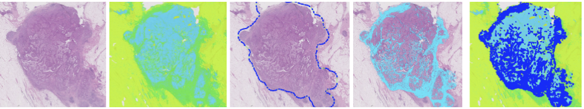

# Pathology Tiger Baseline

This repository contains the code for the [TIGER](https://tiger.grand-challenge.org/) challenge baseline algorithm.

## Weights for Faster-RCNN and Hooknet

- Download: https://surfdrive.surf.nl/files/index.php/s/TAJY8FEFWsLgHj8
- Place the weights in de appropriate subfolders in [models](https://github.com/DIAGNijmegen/pathology-tiger-baseline/tree/main/models). See the readme.md files in the subfolders for more information

# Acknowledgement

This code is made by Cyril de Kock
